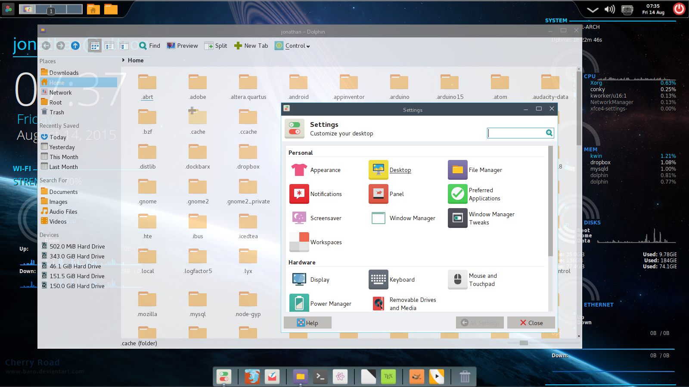

ModernUX is a sleek and modern window decoration theme for the Kwin window
manager, designed to go well with flat themes such as
[Hex Lite](http://kde-look.org/content/show.php/Hex+Lite?content=164224).
It was created using
[Aeri](http://kde-look.org/content/show.php/Aeri+?content=162303) as a basis.

This project includes only a window decoration theme, and does not come with an
icon theme or an interface theme. It is designed to blend in with the Arc
interface and icon them, found [here](http://github.com/horst3180/Arc-theme)

# Preview:

